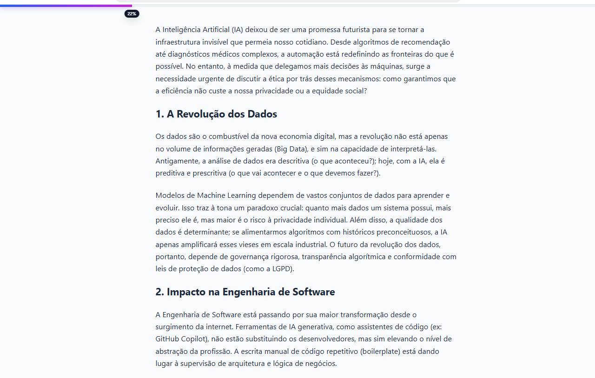

# 📜 Scroll Progress Indicator

> Uma interface elegante de barra de progresso de leitura com indicador numérico flutuante.



## 💻 Sobre o Projeto

Este projeto consiste em uma implementação "Vanilla" (sem frameworks pesados de JS) de uma **Barra de Progresso de Leitura**. O objetivo é melhorar a Experiência do Usuário (UX) em páginas com muito conteúdo textual, fornecendo feedback visual imediato sobre o quanto falta para terminar a leitura.

O foco do desenvolvimento foi a criação de um código limpo, performático e visualmente agradável, utilizando **Tailwind CSS** para estilização rápida e **JavaScript** puro para a lógica.

---

## 🚀 Funcionalidades

- **Barra de Progresso Visual:** Fixa no topo.
- **Indicador Numérico Flutuante:** Um tooltip que acompanha a barra mostrando a porcentagem exata (ex: `45%`).
- **Feedback Dinâmico:** O indicador aparece suavemente apenas quando o usuário começa a rolar a página.
- **Responsividade:** Layout adaptável para desktop e mobile.


---

## 🛠 Tecnologias Utilizadas

- **HTML5:** Estrutura semântica.
- **CSS3 / Tailwind CSS (via CDN):** Para estilização utilitária e responsiva.
- **JavaScript (ES6+):** Lógica de cálculo do viewport e manipulação do DOM.

---

## 🎨 Destaques de Implementação

### 1. UI/UX Refinada
- Uso de `backdrop-blur` para que a barra não esconda completamente o conteúdo atrás dela.
- Animação suave (`transition-all`) na barra para evitar movimentos bruscos durante o scroll.
- O indicador numérico possui lógica para se esconder (`opacity: 0`) quando a página está no topo, mantendo o design limpo.

### 2. Código
A lógica de cálculo considera a altura total do documento menos a altura da janela (`clientHeight`), garantindo que a barra chegue exatamente a 100% no final da página.

```javascript
const scrolled = (scrollTop / (scrollHeight - clientHeight)) * 100;

## 📂 Estrutura de Arquivos

A estrutura foi pensada para projetos estáticos, mantendo a raiz limpa e os recursos organizados:

/progresso_leitura

    │
    ├── assets/              <-- Pasta principal de recursos
    │   ├── js/              <-- Pasta específica para Scripts
    │   │   └── script.js
    │   │
    │   │
    │   └── img/ 
    |        └── image.png     
    │
    ├── index.html           
    └── README.md            <-- Documentação

```
## 🚀 Como executar

1. Clone este repositório:
   ```bash
   git clone (https://github.com/Alicia-Alexia/progresso_leitura)

2. Abra o arquivo index.html em qualquer navegador  


## 🤝 Autor
Desenvolvido por Alicia como parte de estudos em Frontend Development.